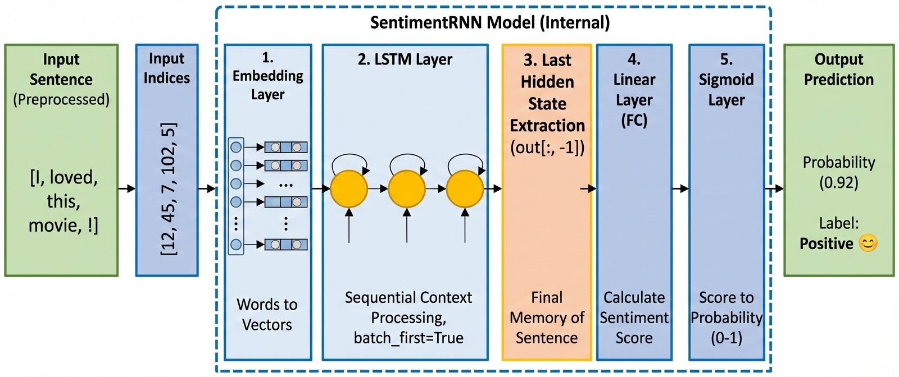

# 🎬 Movie Review Sentiment Analysis (LSTM)

이 프로젝트는 영화 리뷰 데이터를 학습하여 문장의 감정이 긍정(Positive)인지 부정(Negative)인지 분석하는 인공지능 모델을 만드는 실습입니다. 고등학생이나 입문자가 딥러닝의 기초인 자연어 처리(NLP)와 LSTM의 원리를 이해하기 좋게 구성되었습니다.

## 🏗️ 모델 아키텍처 (Model Architecture)

이 모델은 여러 단어로 이루어진 문장을 읽고 하나의 감정 결과(0~1 사이의 확률)를 내놓는 Many-to-One 구조를 가집니다.


*이미지: 생성된 모델 아키텍처 다이어그램을 'architecture.png'로 저장해 넣어주세요.*

### 🔍 단계별 데이터 흐름

1. 입력 문장 (Input Sentence):
   - `"The movie was great"`와 같은 텍스트 데이터가 들어옵니다.
2. Input Indices (단어 번호표):
   - 컴퓨터가 읽을 수 있게 각 단어를 숫자 ID로 변환합니다. (예: `[12, 45, 7, 102]`)
3. 1. Embedding Layer (`nn.Embedding`):
   - 숫자를 좌표로: 단어 번호를 의미를 가진 128차원의 좌표(벡터)로 바꿉니다. 
   - 비슷한 의미의 단어는 지도상에서 가까운 거리에 위치하게 됩니다.
4. 2. LSTM Layer (`nn.LSTM`):
   - 문맥 기억: 단어를 순서대로 읽으며 앞 단어의 정보를 잊지 않고 누적하여 파악합니다.
5. Last Hidden State 추출 (`out[:, -1]`):
   - 최종 느낌: 문장을 다 읽은 후의 '마지막 기억'만 쏙 뽑아냅니다.
6. 3. Linear (FC) Layer (`nn.Linear`):
   - 점수 계산: 최종 기억을 바탕으로 긍정인지 부정인지 점수를 냅니다.
7. 4. Sigmoid Layer (`nn.Sigmoid`):
   - 확률 변환: 점수를 0(부정) ~ 1(긍정) 사이의 확률로 바꿉니다. (예: 0.85 → 85% 확률로 긍정)

---

## 📌 핵심 포인트 (Learning Points)

- 데이터 전처리: `word.isalpha()`를 사용하여 불필요한 기호를 제거하고 순수 단어에만 집중하도록 했습니다.
- 데이터 균형: 긍정 1,000개, 부정 1,000개의 데이터를 사용하여 AI가 편견 없이 학습하게 했습니다.
- 기억력 장치 (LSTM): 긴 문장에서도 중요한 정보를 놓치지 않는 LSTM의 특성을 활용했습니다.
- 시각화: 학습 과정에서 오차(Loss)가 줄어드는 것을 그래프로 확인하며 모델의 발전 과정을 추적합니다.

---

## 🚀 실행 가이드 (How to Run)

### 필수 라이브러리 설치
```bash
pip install torch nltk matplotlib
